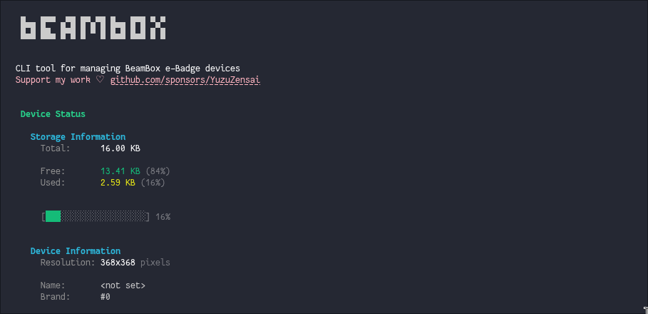

# beamboxctl

Unofficial CLI for managing beambox e-Badge devices over Bluetooth LE.



## About beambox

[beambox](https://beambox.com.cn/) is a consumer electronics brand that makes e-Badge display devices which accept image uploads over BLE. This project is not affiliated with, endorsed by, or supported by the beambox manufacturer.

## Supported Devices

- [beambox e-Badge Pulse (Nikko)](https://beambox.com.cn/pages/shop) (368x368)
- Other beambox e-Badge models may work, but are untested

## Development

Requirements:
- Bun
- Bluetooth LE access on your system

Run in development mode:

```sh
bun run dev
```

Build and run the CLI:

```sh
bun run build
bun run start
```

## Legal

This is an unofficial, community-built project. It is provided as-is without warranty. All trademarks and product names are the property of their respective owners, including beambox.

## License

MIT
